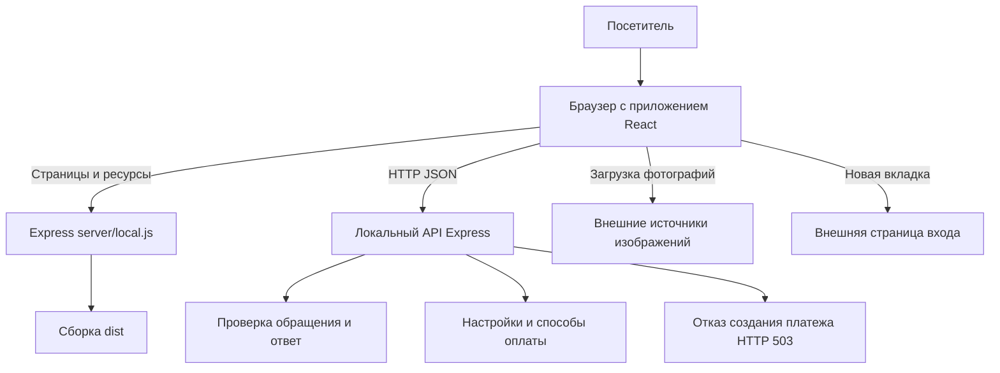

# Архитектура локальной версии BarMixHub

## Компоненты

Приложение состоит из клиентской части React и локального HTTP-сервера Express.
Клиент написан на TypeScript. Vite собирает его в каталог dist.
Сервер server/local.js раздаёт сборку и обрабатывает запросы API на порту 4242.
База данных в локальной версии отсутствует.

## Клиентская часть

- src/App.tsx задаёт маршруты React Router.
- src/pages содержит страницы, src/components — общие элементы интерфейса и формы.
- src/data/content.ts содержит данные интенсива, FAQ и навигации; src/data/legal.ts — тексты документов.
- src/lib/validation.ts проверяет поля, src/lib/api.ts выполняет HTTP-запросы.
- Состояние полей и элементов интерфейса хранится в памяти React. Перезагрузка сбрасывает состояние форм.

## Локальные интерфейсы

| Метод и адрес | Вход | Результат |
|---|---|---|
| GET /api/health | Нет | HTTP 200, признак работоспособности и mode: local |
| GET /api/payments/config | Нет | HTTP 200, настройки, payment_enabled: false |
| GET /api/payments/providers | Нет | HTTP 200, четыре варианта выбора и вариант по умолчанию |
| POST /api/leads | JSON: name, phone, email, message | HTTP 200 с подтверждением либо HTTP 400 с ошибкой проверки |
| POST /api/payments/create | Данные оформления | HTTP 503: оплата недоступна в локальной версии |

Сообщения передаются в UTF-8. Сервер принимает JSON размером до 64 Кбайт.
Наличие вариантов оплаты означает возможность проверять выбор в интерфейсе, а не доступность банковской операции.
Неизвестный путь /api возвращает JSON с HTTP 404. Для адресов страниц сервер отдаёт index.html,
после чего React Router выбирает страницу или экран отсутствующего раздела.

## Обработка обращения

Посетитель заполняет форму. Клиент проверяет поля и отправляет POST /api/leads.
Сервер повторно проверяет данные и возвращает результат. Клиент показывает сообщение.
Сервер не записывает обращение в базу или файл и не вызывает внешние сервисы.

## Режим разработки и границы поставки

Команда npm run dev:local запускает Vite и локальный сервер. Vite передаёт запросы /api серверу 4242.
Команды npm run build и npm run start:local запускают вариант со статической сборкой.
В репозитории также есть server/index.js и модули банковских интеграций;
они не используются командой start:local и не входят в проверку локального API.
Изменение клиентских файлов для собранной версии требует повторного npm run build.
